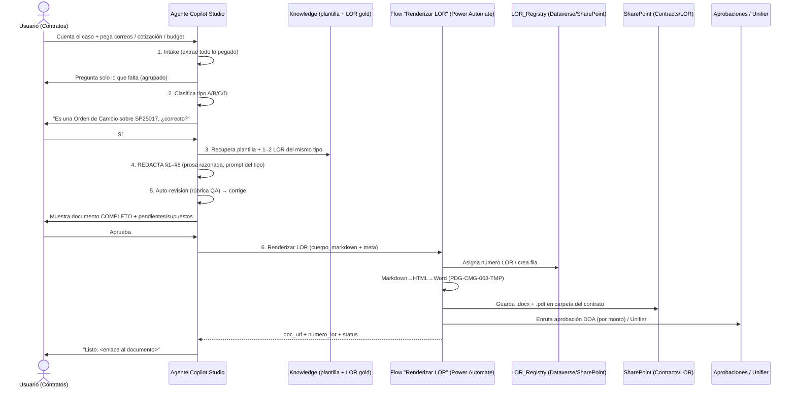
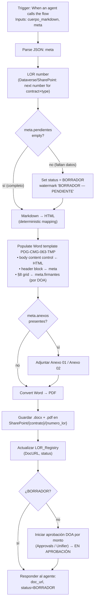

# The New Flow — Visual + Action‑by‑Action Build Recipe

This is the **buildable specification of the new "Renderizar LOR" flow** that replaces the old
JSON‑slot‑filling flow. It is precise enough to stamp out click‑by‑click in Power Automate.

> **Boundary:** these files are the *blueprint*. The flow itself has to be created inside your
> Power Platform tenant (I can't reach it from here) — but every action, connector, input and
> expression is specified below, so it's a mechanical build. The **writing** lives in the
> Copilot Studio agent (see [`../agent/system-prompt.md`](../agent/system-prompt.md)); this flow
> only **renders and routes**.

---

## 1. Runtime — end to end (what happens when a user asks for a LOR)

The decisive difference from today: **step 4 is real writing by the model.** The flow starts at
step 6 and never touches prose.

---

## 2. The flow itself — "Renderizar LOR"

---

## 3. Action‑by‑action recipe (build this in Power Automate)

| # | Action (connector → operation) | Key inputs / expressions |
|---|---|---|
| 1 | **Trigger:** *Copilot Studio → "When an agent calls the flow"* (or *Request → When a HTTP request is received*) | Define text inputs `cuerpo_markdown`, `meta`. |
| 2 | **Data Operation → Parse JSON** | Content: `meta`. Schema from [`../agent/intake-spec.md`](../agent/intake-spec.md) (tipo, contrato_no, numero_cambio, proveedor, monto, moneda, control_account, trend, firmantes[], anexos[], pendientes[]). |
| 3 | **LOR number** — *Dataverse → List rows* (or *SharePoint → Get items*) filtered by `contrato_no`+`tipo`, then compute next; **Add a row** to `LOR_Registry`. | Fallback: `coalesce(body('Parse_JSON')?['numero_lor_sugerido'], concat(...))`. Store `numero_lor`. Idempotency: if a row with the same `numero_lor` exists, reuse it (no duplicate). |
| 4 | **Condition** — drafts vs final | `empty(body('Parse_JSON')?['pendientes'])`. If **false** → set var `status = 'BORRADOR'` and a watermark flag; if **true** → `status = 'FINAL'`. |
| 5 | **Markdown → HTML** — *Content Conversion → "Convert Markdown to HTML"* if available; else a **Compose**/Office Script that maps `#→<h1>`, `##→<h2>`, `###→<h3>`, `**x**→<strong>`, `- →<li>`, GFM tables → `<table>`. | Output: `cuerpo_html`. Keep mapping deterministic. |
| 6 | **Populate Word** — *Word Online (Business) → "Populate a Microsoft Word template"* on `PDG-CMG-063-TMP.docx` (env `template_path`). | Map header content controls from `meta` (proyecto, contrato, proveedor, fecha, título). Map the **body** rich‑text content control ← `cuerpo_html`. Build the **§8 signatory table** rows from `meta.firmantes` (data, not prose). If watermark flag set, fill the watermark control. |
| 7 | **(opt) Attach annexes** — *combine* | If `meta.anexos` non‑empty, append Anexo 01/02 files (Word merge, or combine at PDF step). The flow never authors annex content. |
| 8 | **Convert to PDF** — *Word Online (Business) → "Convert Word Document to PDF"* (or OneDrive convert). | Input: the populated `.docx`. |
| 9 | **Store** — *SharePoint → Create file* (×2: .docx, .pdf) under `«site_url»/«library_path»/«contrato_no»/«numero_lor».{ext}`. | Then *Update item* on `LOR_Registry` with `DocURL`, `status`. |
| 10 | **Route (only if FINAL)** — *Approvals → Start and wait for an approval* (Approve/Reject, **sequential** in DOA order from env `doa_matrix` by `monto`) **or** notify/create the **Unifier** record. | Set `status = 'EN APROBACIÓN'`; write outcome back to the registry. For drafts, skip. |
| 11 | **Respond to the agent** — *Copilot Studio → Respond* (or *Response*) | Outputs: `doc_url`, `numero_lor`, `status`. The agent shows the link to the user. |

### Failure handling (add early)
- After Parse JSON: **Condition** that `cuerpo_markdown` contains `## 1.` … `## 8.`; if a required
  heading is missing or `meta` failed to parse, **Terminate** with a clear error so the agent
  fixes the draft — never render a partial.
- Use `numero_lor` as an **idempotency key** so retries don't duplicate registry rows or files.

### What this flow must NOT do
- ❌ Author or reword any section · ❌ decide the LOR type · ❌ "fill" narrative placeholders
  (there are none — the body arrives written).

---

## 4. Variant — generate prose inside the flow (only if required by governance)

If policy requires the writing to live in the flow instead of the agent, insert **AI Builder →
"Create text with GPT"** (or an Azure OpenAI action) **before step 5**, one call per section,
each fed the type prompt ([`../agent/generation-prompts/`](../agent/generation-prompts/)) + the
facts. The model still writes every section; the flow still never uses `concat()` for prose.
Most teams should keep writing in the **agent** (simpler, more Copilot‑native) and leave this
flow purely mechanical.

---

## 5. Build order checklist
1. Create `LOR_Registry` (Dataverse table or SharePoint list) + the `PDG-CMG-063-TMP` template
   with content controls (body + header + §8 table + watermark).
2. Set environment variables (`site_url`, `library_path`, `template_path`, `doa_matrix`, defaults).
3. Build actions 1–11 above; add failure/idempotency guards.
4. In Copilot Studio, add this flow as the tool **"Renderizar LOR"** (see
   [`copilot-studio-setup.md`](copilot-studio-setup.md)).
5. Run the **type test matrix** (A/B/C/D) and verify against
   [`../agent/qa-review-rubric.md`](../agent/qa-review-rubric.md).
